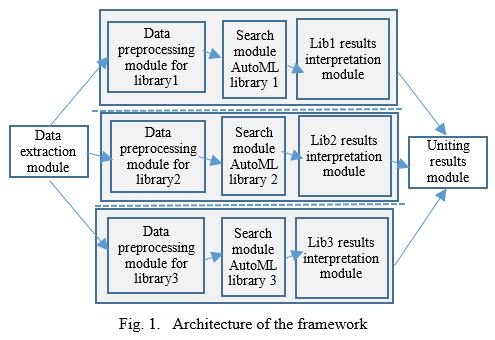

# AutoML-Framework 

AutoML-Framework that uniting several popular AutoML tools. Different AutoML libraries that use Scikit-Learn as a source of algorithms cannot run together because of their dependency on different versions of libraries; in particular, Auto-Sklearn cannot run together, neither with TPOT nor with Hyperopt-Sklearn. Therefore, two separate components were developed within the framework: one unites Auto-Sklearn and H2O, and the other works with TPOT, Hyperopt-Sklearn, and H2O. 

The framework takes as input the dataset, the ratio in which the data has to be splitted into train and test sets and the time limit for each possible solution to run. Then each AutoML library runs in a separate thread with given data and limits. After the search is done, the results are summed up in a common table. The general architecture of the framework is shown in Fig. 1.

The framework contains the following modules:

**Data extraction module.** The data extraction module extracts the data to be processed. Users can load the data either from the open repository OpenML.org by dataset id or from a local CSV file provided as an input. The data is stored as a DataFrame in the Pandas library, and all preprocessing modules receive the same data.

**Data preprocessing module.** Each AutoML library requires attributes and target to be presented in a specific form in order to perform search, e.g. the target for the classification task should be categorical. This module checks input data and performs transformation should the need arise. At this step the data is also splitted into training and test sets with the same ratio for all used libraries.

**Search module.** After the data is prepared and splitted, the test set and the target are forwarded to the search module. The search module performs a search for a machine learning model in a specific AutoML library with the same limits, e.g., running time across all used libraries.

**Result interpretation module.** Once calculated, the metrics for models discovered by all AutoML libraries are stored in a common results table, which can then be saved as an .xlsx (Excel) file

**Uniting module.** After the metrics for models found by all AutoML libraries are calculated, they are stored in a common results table, which can then be saved as an.xlsx (Excel) file.

The work of the framework can be started by calling the function “runAutoML”. This function has three parameters: 
1.	Dataset – if the parameter is numeric then it means ID in OpenML repository, if it is a string then name of csv file;
2.	Time – maximum running time allocated for a search (integer, number of seconds);
3.	Ratio – split ratio for division data into train and test sets (real number between 0 and 1, ratio of the training set).
   
Examples of Framework launch: 
- runAutoML("IBM-Employee.csv", 300, 0.75) – load data from file "IBM-Employee.csv”, divide into 3/4  training and 1/4 test sets and perform search for 5 minutes. 
- runAutoML(4153, 900, 0.80) - load the dataset with the ID 4153 from OpenML, split into 4/5 training  and 1/5 test sets and perform search for 15 minutes.

